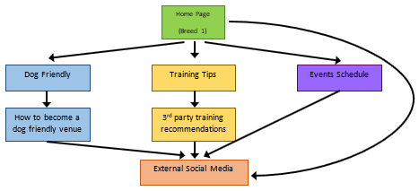
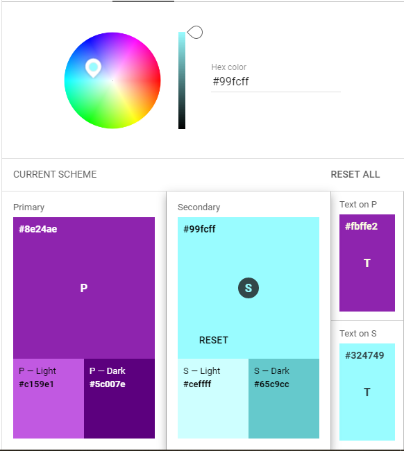
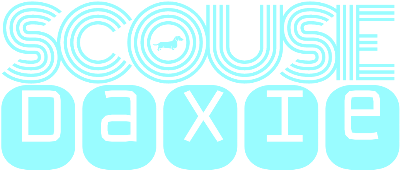
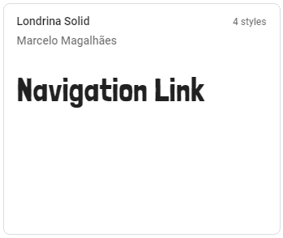
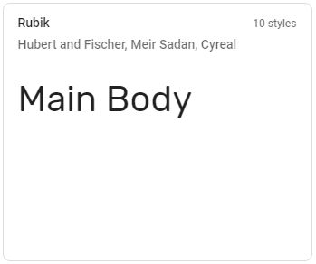

# Scouse Daxie - README

A social space targeting Dachshund owners in Liverpool. The site aims to provide community through existing social media and free organsied social events. The site offers advice and tips on dog friendly bars, pubs, restaurants and other venues/establishments along with training tips and 3rd party training in the area.

The site could eventually generate revenue through attracting local businesses and suppliers to advertise or promote their relevant offerings. One future option is to create an online store platform selling relevant products either directly or in acting as an intermediary.

Whist the site currently heavily relies upon existing social media platforms for inter-user interaction, user to business interaction and events sign-up and bookings the intention is to build thie functionality locally into the site with time.

The site can expand to include additional content for other dog breeds in the geographic area and also expand to other locations in the future. By narrowing the target audience initially it allows bespoke, attractive content and a managable scope. Choosing a popular breed increases the interest in the content and initial user pick-up.

## UX Design

The Scouse Daxie site was designed following a User Experience Design planning process which established a set of goals for the core user groups, the minimum viable product to achieve these goals and future development potential.
The scope set out the required pages and content based on several developed user stories.
An initial site structure was outlined and a future expansion proposed as content and coverage increased.
Wireframes provided a means of limiting mission creep and making key decisions prior to the commencement of coding.
Colour schemes, font types and icons were all researched and in advance and a colour palette and template font-family code added to the initial styles.css file for ease of use and consitency.

A review meeting refined the initial plan, scaling back the number of pages by combining several sub-pages into their parent pages, and the colour palette and fonts were revised to ensure visual contrast and readibility. The use of free logo making utilies was also advised to reduce the number of utilised fonts.

### Strategy

The following Users were identified and their goals established:

#### The Business

- Establish a go-to brand for the Dachshund Owners in Liverpool (UK).
  - First port of call for owners looking for advice on caring for their dogs, training, behaviour, most appropriate items for the breed i.e. harnesses, collars, jackets etc.
- Build a network of users who “crowd-source” potential future site content i.e. new advice or tips.
- Highlight the popularity of dog-friendly venues in Liverpool to encourage more venues to become dog friendly.
- Work with venues to advise on top tips for becoming dog friendly.
- Encourage venues to advertise on the site (potential revenue).
- Encourage manufacturers/suppliers to advertise products on site (potential revenue).
- Launch regular free events such as group walks, playdates and meetups.
  - This could eventually lead to paid/ticketed events (potential revenue).

#### General Consumers

- Receive sound advice and provide best possible care for their dog(s).
- Recommendations on products.
- Confidence in attending venues with the knowledge it caters for dogs well.
- Socialisation of both the owners and their dogs.
  - Remotely (via social media)
  - Physically (walks, events)
- Show off their pride and joy
  - Image/video sharing
- Show of their knowledge
  - User to user interaction.

#### Other 3rd Party businesses

- Increase revenue
- Create repeat custom
- Reach specific target market
- Diversify
- Potentially enter e-commerce via a 3rd party (i.e. the site).

#### Minimum Viable Product

The mimimum product required to achieve the majority of the above goals was defined as requiring:

- A regular events calendar
- Non-interactive "dog-friendly" venue guidance.
- Non-interactive training and training provider advice.
- Links to established social media pages to provide interactivity.

An Opportunity Importance vs Feasibility assessment was carried out: [Opportunity Assessment PDF](assets/docs/opportunity_assessment.pdf)

### Scope

The scope of the project was to initially create a fun, catchy, visually appealling site and establish brand recognition. Written content was to be kept minimal and of value to the user.
At this stage user interactivty must be provided by external social media in order to ensure a swift roll-out.
The aim was to build a site which focuses on satifying the **General Consumers** and **The Businesses** goals on the premise that establishing these will contribute towards brand appeal with the **3rd Party Business** user group and assist in achieving this groups goals in the near future.

The scope identified the following as required content:

- Homepage.
  - Introduction to brand and purpose.
  - Highlight key content.
- Dog-Friendly venues page.
  - Immediate content with value to **General Consumers**.
  - Links to **3rd Party Businesses** eventually attracting collaboration.
  - Provide advice to **3rd Party Businesses** on how to qualify for inclusion.
- Training Tips Page.
  - Training advice is always sought by **General Consumers**. The inclusion of this content will promote initial traffic on the site.
  - Providing professional training recommendations again provides buy-in for **3rd Party Businesses**.
- Events page.
  - Builds community.
  - Encourages interaction and repeat engagement.
  - Promotion through word-of-mouth.

User stories were created for representatives of each core user group.

| User                 | Story                                                                            |
| -------------------- | -------------------------------------------------------------------------------- |
| The Business         | [The Businesses User Story](assets/docs/the_business_user_story.pdf)             |
| General Consumer     | [The General Consumer User Story](assets/docs/general_consumer_user_story.pdf)   |
| 3rd Party Businesses | [3rd Party Businesses User Story](assets/docs/3rd_party_business_user_story.pdf) |

### Structure

As an unestablished brand it is critical that the structure provide an intuitive, rewarding and positive user experience.
All users will be unfamiliar with the site and if navigating it proves difficult or the experience is unrewarding or negative then the user is unlikely to return.

The header and footer will be common across all pages to improve familiarity across the site.

The inital navigation structure was planned in a simple tree, minimising the number of clicks for the user. All pages are accessible from all other pages thanks to the common header and footer.

This was revised following the initial planning meeting to further reduce the site complexity by merging the sub-pages into their parent pages i.e. "How to become a dog friendly venue" content is present on the "Dog Friendly" page.

A possible future structure was also proposed should business goals be achieved and the scope of the brand, the site and its content expands.

The purpose of the revised structure would be to reduce the reliance on external social media platforms and increase the potential user base by expanding across different dog breeds and different geographic locations.

As an aside this is the justification for the inclusion of a strapline or sub-heading, as this would form the overarching brand as currently the main brand is both geographically and breed constrained.

The expanded structure would segregate geographic content, and breed specific content within that and add in common features such as an online store.

### Skeleton

A modern site must be responsive across multiple device sizes as consumers digest content in a vairety of methods in a multitude of locations.

As the site is intended for casual and leisure use it is also likely that the content will be first encountered on a mobile device.

It is therefore prudent to utilise a mobile first approach and Bootstrap provides such a framework that is also highly responsive. Bootstrap was used to achieve the skeleton objectives towards the identified users.

Wireframes were constructed in Basamiq Wireframe 4 in order to provide a design brief for the project, maximise coding productivity and minimise mission creep.

In some instances the wireframe plan was deviated from in order to achieve a better asthetic and user experience not forseen in the wireframe design phase.

[Post Production Wireframe Analysis](wireframes.pdf) provides an overview of the planned wireframes and deviations found in the final product if applicable.

### Surface

The site is intended primarily for the leisure and hospitality market. The colour and themes were important in setting the correct tone.
It was also identified that the geographic location could be represented by colour, text or imagery iconography.

As a site focusing geographically on Liverpool and Merseyside a palette focused around purple was chosen. This tactfully avoids red or blue colours which are synonymous with the cities major football teams and prevents any unintential bias or division for the Scouse Daxie brand.
This primary colour also ties in nicely with one of the cities other promient features, its wheelie bins, which were coloured purple by the city council as balance between both red and blue in order to avoid the same potential conflict.

An initial colour palette was discussed at the planning meeting and enhanced with the use of Material Design's Color Tool which assists in the identification of complimentary shades and contrasting secondary and text colours.

A logo was created using an online tool in order to utilise decorative cursive fonts provided by Google without impacting page load time. The Monoton and Monofett fonts were identifed as the provided a conteporary styling which was bold and readable, whilst fitting in well with Liverpool's urban scene.

A further cursive font, Londrina Solid, was utilised sparingly for the navigation links in the header bar and the strapline/subtitle in order to not overwhelm the user with intricate font faces whilst maintaining a fun and casual feel.

A slightly more formal, but interesting sans-serif derived Google Font, Rubik, was used for all remaining text to ensure legibility and maximum effectiveness of conveying the sites content.

Across the site and its pages it was critical to ensure consitency with styling of all elements including text, headers, buttons and media. This ensures maximum potential for user understanding and learning.

Where praticable icons from Font Awesome were used to convey and enhance the intended message to the user.

All media utilised on the site is original in its source in part to avoid potential copyright infingement but also to promote the use of unique user-driven content on site in the future.

Google Maps were used to enhance the sites geographical importance.

Where possible the use of absolute units has been avoided in preference for relative units. This is to ensure maximum site responsiveness.

## Features

### Existing Features

| Feature                         | The Business                                                                                                    | General Consumer                                                                                         | 3rd Party Businesses                                                                               |
| ------------------------------- | --------------------------------------------------------------------------------------------------------------- | -------------------------------------------------------------------------------------------------------- | -------------------------------------------------------------------------------------------------- |
| Subscribe to Newsletter Form    | Collect contact information. Direct promotions. Build up user base.                                             | Keep up-to-date with latest information. Inclusion.                                                      | Promote their services or products to an opt in audience.                                          |
| Homepage Introductory Text      | Sets the purpose of the site and brand and targets intended users                                               | Makes a decision on whether the site is useful to them. Understands its purpose.                         | Makes a decision on whether the site is useful to them. Understands its purpose.                   |
| Homepage Upcoming Events        | Promote that there are lots more events.                                                                        | Become aware of events. Access events for sign up on social media. Access more events.                   | Sees the potential for hosting/supporting/attending future events.                                 |
| Footer Social Media Links       | Provides interactivity to users.                                                                                | More familiar interface to become familiar with the brand. Interacts with the brand and each other.      | Becomes aware of the size of the userbase through their interactions.                              |
| Dogs Allowed Venue Map          | Presents geospatial information in an intuitive way.                                                            | Recieves content in a familiar format. Able to interpret quickly to apply to their own needs.            | Awareness of competition. Awareness of value of this as a promotional tool. Fear of Missing Out.   |
| Dogs Allowed Venue Cards        | Produces micro-review and opinion content to inform consumers and attract new 3rd party business collaboration. | Provided further information on venue specifics other than location.                                     | Provided information on competitors advantages and disadvantages. Potential promotion opportunity. |
| How to be Dog Friendly Cards    | Actively targets the 3rd Party Business users to try and include them and provide value for this user group.    | Provides a benchmark to privately assess venues. Potential mouth-to-mouth marketing between user groups. | Receives advice. See's value in the sites content. Works to a standard. Works with the brand.      |
| Training Tips (Video and Steps) | Recieves greater site traffic.                                                                                  | More likely to come across site. Is provided with practical information. May refer content to a friend.  | May see value in collaboration. Preceives value in site traffic.                                   |
| Training Recommendations Map    | Presents geospatial information in an intuitive way.                                                            | Recieves content in a familiar format. Able to interpret quickly to apply to their own needs.            | Awareness of competition. Awareness of value of this as a promotional tool. Fear of Missing Out.   |
| Dogs Allowed Venue Cards        | Produces micro-review and opinion content to inform consumers and attract new 3rd party business collaboration. | Provided further information on venue specifics other than location.                                     | Provided information on competitors advantages and disadvantages. Potential promotion opportunity. |
| Events Cards                    | Promotes organised events and encourages user engagement. Sets the tone of the brand. Promotes user interaction | Attends events. Meets like-minded people. Potentially recommends site to others.                         | Perceives value of the site and brand. Collaborates on events.                                     |

### Minor Improvements

- Tooltips would be advantageous on venue icons to improve user understanding.

- The events carousel at large breakpoints could be improved to allow a greater number of events to be posted. Currently it is limited to 12 due to the toggle buttons linking to the start and end of the overflowed container, with only 6 events displayed on the page at any one time.

- The down caret icons added to all collapsing toggles could be made to switch to up carets when the collapsed item is open.

- The map locations could link to the relevant cards and vice-versa.

- Collapsable sections could better control related collapsable sections i.e. only one open at once, or an entire row opens and closes at the same time.

### Future Features

| Feature                    | The Business                                                                                         | General Consumer                                                      | 3rd Party Businesses                                 |
| -------------------------- | ---------------------------------------------------------------------------------------------------- | --------------------------------------------------------------------- | ---------------------------------------------------- |
| Event sign-up on site      | Reduces reliance on external providers. Keeps users on the businesses platform and near its content. | More streamlined user experience.                                     | More professional perception of brand and site.      |
| Product review/advice      | Expands potential user base for consumers and 3rd party businesses.                                  | More content to consume. More frequent and longer visits to the site. | A new platform to promote their products.            |
| On site store for products | Provides a revenue stream and further user base expansion.                                           | Source for content relevant products.                                 | A platform to collaborate and use. Also a competitor |
| Site Gallery               | Enhances user interaction and provides crowd-sourced, self-sustaining content.                       | More streamlined user experience. Added site value.                   | Increase value perception of the brand and site.     |

## Technologies Used

### Bootstrap 4.4.1

https://getbootstrap.com/

Bootstrap was used to provide a front-end component library structure and responsive design framework. It also provided some basic JavaScript functionality which did not require developer interaction. 

#### License

Bootstrap is released under the MIT License (MIT)

A copy of this license is provided in Bootstraps GitHub Project:
https://github.com/twbs/bootstrap/blob/v4.5.0/LICENSE 

Bootstrap Copyright is as follows:
Copyright (c) 2011-2020 Twitter, Inc.
Copyright (c) 2011-2020 The Bootstrap Authors

### LogoMakr

Produced the brand logo using a combination of Google Fonts and icons.

https://logomakr.com

https://logomakr.com/getstarted/terms-conditions/

### Google Fonts

Google Fonts offers open source font styling options for personal and commercial use. 2 fonts were used within styles.css. A further 2 fonts were used within Logomakr to create the site logo. 

#### License

The use of this product was inline with Google API's terms of service https://developers.google.com/terms

### Font Awesome 5.1.3.

Font Awesome provides text based icons which can be manipulated and controlled by CSS styling. These were used throughout the site to provide visual ques to content.

#### License

Icons are licensed under the CC BY 4.0 https://creativecommons.org/licenses/by/4.0/

Fonts are licensed under SIL OFL 1.1 https://scripts.sil.org/OFL

Code is licensed under MIT https://opensource.org/licenses/MIT

### Google Maps

Specific maps were created in Google Maps highlighting specific groups of locations. these were embedded as iframes into various pages on the site.

#### License

The use of this product was inline with Google API's terms of service https://cloud.google.com/maps-platform/terms?_ga=2.160045053.1717626391.1589905262-667397718.1588149057

### Adobe Photoshop Express

Photoshop Express was used to compress images using its save settings functionality to reduce the file size to 25% its original size. Occasionally the dimensions were also altered within save settings and/or via the crop tool. The results of this compression were comparable with other compression services. 

#### Terms of Use

Photoshop Express operates under its General Terms of Use: https://www.adobe.com/legal/terms-linkfree.html 

### Youtube

Hosts the sites embedded videos. 

#### Terms of Use

Youtube is utilised under its terms: https://www.youtube.com/t/terms

### Facebook

Hosts the interactivity of the brand including user posts and event registration. 

#### Terms of service

Facebooks terms of Service can be found here: https://www.facebook.com/terms.php

### Instagram

Instagram is utilised by the brand to post media content. As part of Facebook it falls under Facebooks Terms.

#### Terms of Use

A link to Instagrams' specific terms can be found here: https://help.instagram.com/581066165581870

### Twitter

Twitter is used as a tool to reach potential new users and promote the brand and its ideas. 

#### Terms of Service

Twitters terms of service can be found here: https://twitter.com/en/tos

## Testing

Am I Responsive

## Deployment

The site is stored and hosted on GitHub Pages. 

It consists of 1 Master branch and no other branches.

The URL for the site is: https://kwsnick.github.io/ScouseDaxie/ 

The URL for the GitHub Project is: https://github.com/KWSNick/ScouseDaxie 

The site is designed to work on any Modern Browser, but was designed and developed specifically in Google Chrome version 81.0.4044.138.

## Credits

### Content

Site content is original and developed by the author to offer an opinion and recommendation in good faith. No liability is assumed for any user experiences outside of this website.

The content was correct to the best of the authors knowledge at the time of issue.

The content was created without outside influence including but not limited to payment for advertisement or promotion and bias based upon personal relationships and experiences.

A link to Wikipedia is present on the homepage. This links to an explaination of what a Lambanana is. https://en.wikipedia.org/wiki/Superlambanana 

### Media

Copyright 2020 Nicholas Bowley

All images are originals and the property of the author and subject to copyright restrictions and limitations.

All videos are orginals and the propery of the author and subject to copyright restrictions and limitations.

The logo was created by the author in logomakr online tool and is accredited as per the instruction of the tool's developer. It is subject to copyright restrictions and limitations

### Acknowledgements

Material Design's Color Tool enhanced the colour palette of the site. https://material.io/resources/color/#!/?view.left=0&view.right=0

Thanks to Liverpool City Council for the foresight in overcoming the Red and Blue divide by producing Purple wheelie bins!

Also thank you to the [Code Institute](https://codeinstitute.net/) for the training and Gitpod support files required in order to complete this site.

And a special mention to Akshat Garg who provided mentoring support and guidance throughout the project. 

## Contributing

This project is a closed example for educational and abilty demonstration purposes. Contribution is not permitted at this time. 

## Support 

For queries or support contact nicholasbowley@googlemail.com.

## License

This site is licensed under the 2-Clause BSD License

Copyright 2020 Nicholas Bowley

Redistribution and use in source and binary forms, with or without modification, are permitted provided that the following conditions are met:

1. Redistributions of source code must retain the above copyright notice, this list of conditions and the following disclaimer.

2. Redistributions in binary form must reproduce the above copyright notice, this list of conditions and the following disclaimer in the documentation and/or other materials provided with the distribution.

THIS SOFTWARE IS PROVIDED BY THE COPYRIGHT HOLDERS AND CONTRIBUTORS "AS IS" AND ANY EXPRESS OR IMPLIED WARRANTIES, INCLUDING, BUT NOT LIMITED TO, THE IMPLIED WARRANTIES OF MERCHANTABILITY AND FITNESS FOR A PARTICULAR PURPOSE ARE DISCLAIMED. IN NO EVENT SHALL THE COPYRIGHT HOLDER OR CONTRIBUTORS BE LIABLE FOR ANY DIRECT, INDIRECT, INCIDENTAL, SPECIAL, EXEMPLARY, OR CONSEQUENTIAL DAMAGES (INCLUDING, BUT NOT LIMITED TO, PROCUREMENT OF SUBSTITUTE GOODS OR SERVICES; LOSS OF USE, DATA, OR PROFITS; OR BUSINESS INTERRUPTION) HOWEVER CAUSED AND ON ANY THEORY OF LIABILITY, WHETHER IN CONTRACT, STRICT LIABILITY, OR TORT (INCLUDING NEGLIGENCE OR OTHERWISE) ARISING IN ANY WAY OUT OF THE USE OF THIS SOFTWARE, EVEN IF ADVISED OF THE POSSIBILITY OF SUCH DAMAGE.

For clarity all media and textual 'print' content including but limited to images in jpeg, jpg or png format, videos in mp4 or wmv format, titles, headers and paragraphs are protected by Copyright and all rights are resevered on these items. 